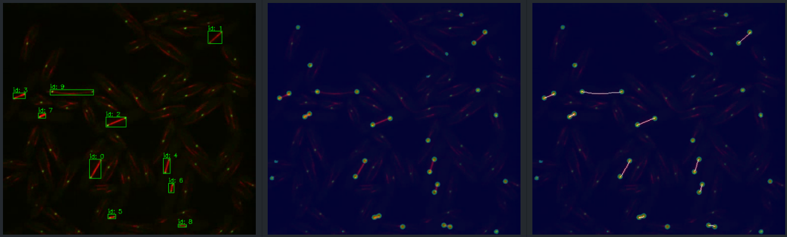

# SpindlesTracker

SpindleTracker is a automatically pipline for spindles detection, tracking and analysis. 


## 1. Visualization demo


## 2. Install
```bash
cd SpindleTracker
pip install -r requirements.txt
pip install -e .
```

## 3. Usage

### 1. Download the demo data and YOLOX-SP ONNX model
* Demo file download: [Google Drive](https://drive.google.com/drive/folders/1C_d2gVMFe43_rwdn6I7tvl8x0cdXtRjb?usp=share_link)
(put the data to `demo/data`)

* YOLOX-SP model download: [Google Drive](https://drive.google.com/file/d/1jV5lB8FFp0J5lwaogQAP657D74x03R_K/view?usp=share_link)
(put the weight to `module/detection/weight`)

### 2. Images Detection Demo

* step2: run the following:
```bash
python demo_img.py --images path/to/input/image.png --model path/to/onnx/model
```
The results is saved in the image path (detection, mask and skeleton as shown in following).




### 3.2 TIF Input Demo
* step1: import the ONNX model from YOLOX-SP and put it into `module/detection/weight` path (default path).

* step2: run the following:
```bash
python demo_tif.py --images path/to/input/image.tif --model path/to/onnx/model --save_path path/to/save
```
The results is saved in save path. NOTE that the tif need to be double channel (red and green). The other input tif need to change the image propressing file and retrain the YOLOX-SP model.